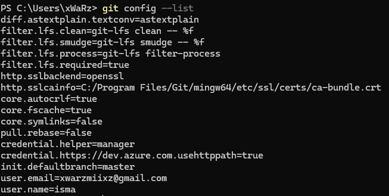
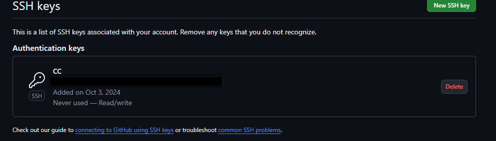

# Entorno de trabajo

> En Este fichero se encuentran las configuraciones de git que se han realizado en el proyecto.

## Configuración del perfil

Desde la propia interfaz de GitHub, se ha configurado el perfil de forma pública, agregando mi nombre, una foto de perfil no personal para mayor privacidad, la ubicación y la universidad en la que se está desarrollando este proyecto.

Además, se ha configurado el perfil de git en local, añadiendo el nombre y el correo electrónico con el que podremos "firmar" nuestros commits con este listado de comandos:

```bash
git config --global user.name "isma"
git config --global user.email "xwarzmiixz@gmail.com"
git config --list
```

Con el último comando, se puede comprobar que la configuración se ha realizado correctamente:


## Generación de claves SSH

Para poder realizar commits en el repositorio de GitHub sin tener que introducir las credenciales cada vez, se ha generado una clave SSH en local y se ha añadido a la cuenta de GitHub:

```bash
ssh-keygen -t rsa -b 4096 -C "xwarzmiixz@gmail.com"
type ~/.ssh/id_rsa.pub
```

Una vez generada la clave, se ha copiado el contenido del archivo `id_rsa.pub` y se ha añadido en la configuración de la cuenta de GitHub, en la sección de claves SSH:


Para comprobar la correcta configuración, realizamos un commit con la subida de este fichero y comprobamos, además de que no nos pide las credenciales, que el commit se ha realizado correctamente con nuestras credenciales:


[🔙 Volver al índice](../../README.md)
