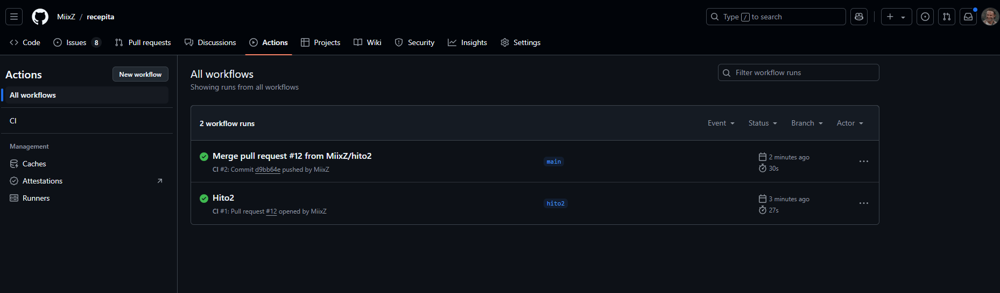

# HITO 2

## ✏️ ELECCIÓN DE GESTOR DE TAREAS

En este proyecto, el gestor de tareas elegido es el sistema de scripts de _npm_, que es el estándar en proyectos JavaScript/TypeScript y simplifica la integración de comandos personalizados. Esto permite ejecutar pruebas con _npm run test_ (comando personalizado creado por mí), asegurando un comando simple y consistente para entornos locales y de CI/CD (integración y entrega continua). npm es ampliamente adoptado, fácil de configurar, y permite definir scripts adicionales (como test:watch para pruebas en modo continuo). Para ver más información acerca de npm, puedes visitar su [página oficial](https://www.npmjs.com/). Para ver más detalles acerca del script, puedes visitar el archivo [package.json](../../package.json), en los subcampos 'test' y 'test:watch' del campo 'scripts'.

### Justificación:

npm es ideal porque:

- Es una herramienta estándar en proyectos Node.js, eliminando la necesidad de herramientas adicionales.
- Facilita la consistencia de comandos en entornos locales y CI/CD.
- Permite definir scripts personalizados y combinar herramientas fácilmente.

### Alternativas consideradas:

- **Yarn**: Yarn es una alternativa a npm que ofrece mejoras en la velocidad de instalación y resolución de dependencias. Sin embargo, npm es más ampliamente adoptado y ofrece una funcionalidad similar.
- **Gulp**: Gulp es una herramienta de automatización de tareas que permite definir flujos de trabajo complejos. Sin embargo, para este proyecto, la simplicidad de npm es suficiente y no se requiere la complejidad adicional de Gulp.

## 🧾 ELECCIÓN DE BIBLIOTECA DE ASERCIONES y TEST RUNNER

**Jest** ha sido la elegida, ya que incluye una biblioteca de aserciones que es potente, flexible y fácil de usar. Con Jest, podemos comparar fácilmente valores esperados y reales usando una amplia gama de métodos de aserción, como expect(value).toBe(expected) o expect(value).toEqual(expected). Además, Jest permite desarrollar en estilo BDD (Behavior-Driven Development), que hace que las pruebas sean más legibles, con descripciones claras de cada caso. Además, Jest sirve a su vez como **test runner**, lo que significa que puede ejecutar pruebas de forma rápida y eficiente, proporcionando informes detallados sobre los resultados de las pruebas.

Adicionalmente, **supertest** también ha sido elegido para realizar pruebas de integración en APIs REST. Supertest es una biblioteca de pruebas de superagente que permite realizar solicitudes HTTP a la API y realizar aserciones sobre las respuestas. Supertest es ideal para probar APIs RESTful y verificar que las rutas y controladores funcionen correctamente. Junto con Jest, Supertest proporciona una solución completa para pruebas de API.

Un ejemplo de salida de Jest (para los tests realizados en [fichero de tests](../../tests/general.test.ts)) sería:

```bash
 PASS  tests/general.test.ts
  √ Devuelve un JSON (32 ms)
  √ Tests de recetas (6 ms)
  √ Tests de recetas fallidos (7 ms)

    Test Suites: 1 passed, 1 total
    Tests:       3 passed, 3 total
    Snapshots:   0 total
    Time:        2.302 s, estimated 4 s
```

### Justificación:

Jest es ideal como biblioteca de aserciones porque:

- Ofrece una API de aserciones intuitiva y robusta para verificar resultados.
- Soporta el estilo BDD, con descripciones claras y legibles, ideal para casos de uso de alto nivel y fáciles de entender.
- Incluye métodos de comparación avanzados que permiten verificar desde igualdad básica hasta objetos profundos, lanzamientos de errores, e incluso funciones asíncronas, esencial para pruebas de APIs y microservicios.

### Alternativas consideradas:

- **Mocha y Chai**: Mocha es un marco de pruebas y Chai es una biblioteca de aserciones. Juntos, ofrecen una combinación poderosa y flexible para pruebas. Sin embargo, Jest proporciona una solución todo en uno que simplifica la configuración y el uso.
- **Jasmine**: Jasmine es un marco de pruebas que incluye una biblioteca de aserciones. Aunque es una opción sólida, Jest ha ganado popularidad en la comunidad de JavaScript por su velocidad y facilidad de uso.

## ⚙️ INTEGRACIÓN DE PRUEBAS

Como ya hemos descrito anteriormente, los scripts personalizados definidos en el archivo [package.json](../../package.json) permiten definir comandos personalizados, en los que además podemos especificar a la hora de buildear nuestro proyecto que se ejecuten las pruebas.

Para ello, en el script para buildear nuestro proyecto (traducir TypeScript a JavaScript nativo), se ha añadido el comando 'test' para ejecutar las pruebas. De esta forma, cada vez que se ejecute el comando 'npm run build', se ejecutarán las pruebas automáticamente.

```json
  "scripts": {
    "dev": "nodemon -x ts-node -r tsconfig-paths/register src/app.ts",
    "start": "node dist/app.js",
    "build": "tsc && npm test",
    "test": "jest --config jest.config.ts --verbose --silent",
    "test:watch": "jest --config jest.config.ts --watchAll --verbose --silent"
  }
```

Con el primer comando ejecutamos el proyecto en desarrollo (para probarlo nosotros en local), con el segundo comando ejecutamos el proyecto en producción (ya compilado), con el tercer comando compilamos el proyecto y ejecutamos las pruebas, con el cuarto comando ejecutamos las pruebas y con el quinto comando ejecutamos las pruebas en modo continuo (para que se ejecute automáticamente cuando hagamos un cambio y no tener que ejecutarlo continuamente).

## 🦾 GITHUB ACTIONS

Para la integración continua de las pruebas, se ha configurado un flujo de trabajo en GitHub Actions que ejecuta las pruebas automáticamente cada vez que se realiza un _push_ o _pull request_ en la rama principal del repositorio. Esto garantiza que las pruebas definidas en el [fichero](../../tests/general.test.ts) por nuestro script se ejecuten de forma automática y se verifique la integridad del código en cada cambio. El flujo de trabajo se encuentra en el archivo [ci.yml](../../.github/workflows/ci.yml). Un ejemplo de esto puede verse en la siguiente imagen:



Los tests que se ejecutan son simples:

- Test que comprueba que la respuesta devuelta es siempre un JSON.
- Tests que comprueba que se devuelve una receta (por ahora una cadena simple) y siempre con el mismo formato.
- Test que comprueba que se devuelve un JSON con un error cuando no se encuentra el endpoint, en este caso el endpoint de una receta.

### Justificación:

GitHub Actions es ideal para la integración continua porque:

- Es una herramienta nativa de GitHub que permite automatizar flujos de trabajo.
- Ofrece una integración perfecta con repositorios de GitHub, lo que facilita la configuración y el uso.
- Proporciona una amplia gama de acciones predefinidas y personalizables para ejecutar pruebas, despliegues y otras tareas.

### Alternativas consideradas:

- **Travis CI**: Travis CI es una plataforma de integración continua basada en la nube que permite ejecutar pruebas y despliegues automáticamente. Aunque es una opción popular, GitHub Actions ofrece una integración más estrecha con GitHub y una configuración más sencilla.
- **CircleCI**: CircleCI es otra plataforma de integración continua que permite ejecutar pruebas y despliegues automáticamente. Aunque es una opción sólida, GitHub Actions es más fácil de configurar y usar.
- **Jenkins**: Jenkins es una herramienta de automatización de código abierto que permite ejecutar flujos de trabajo complejos. Aunque es una opción poderosa, GitHub Actions es más fácil de configurar y usar para proyectos más pequeños.
