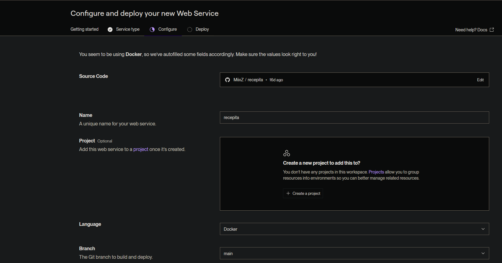
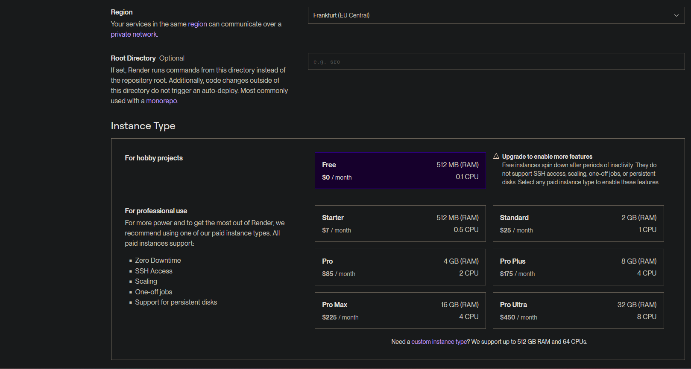
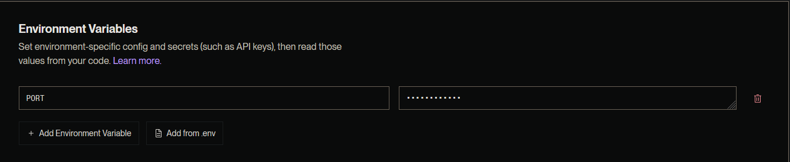
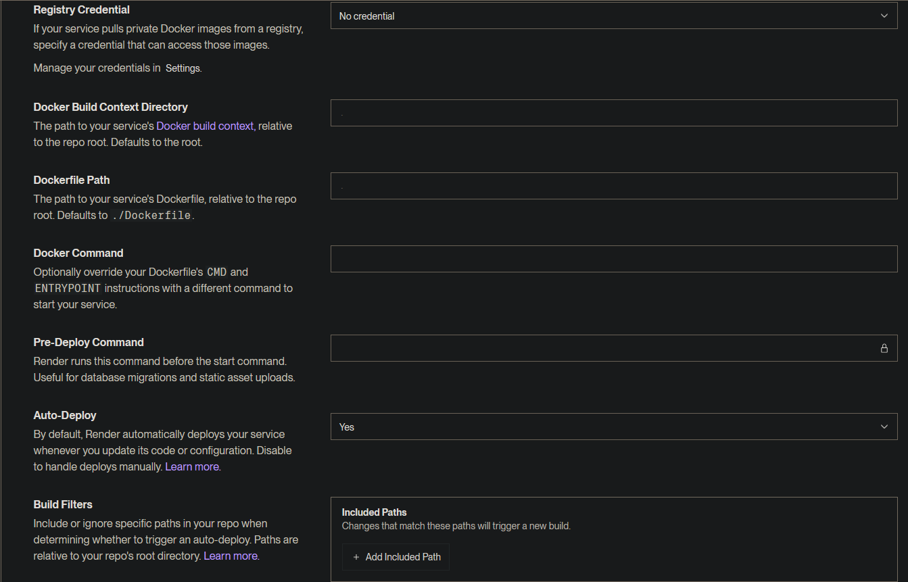
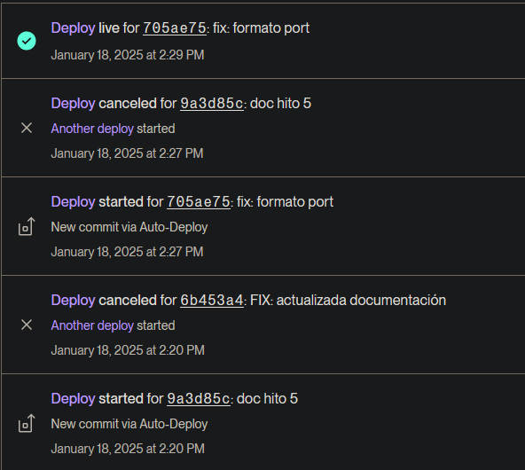
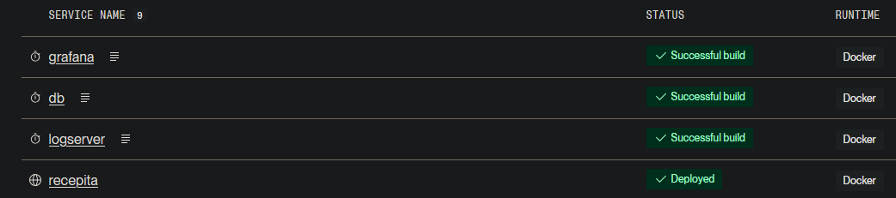
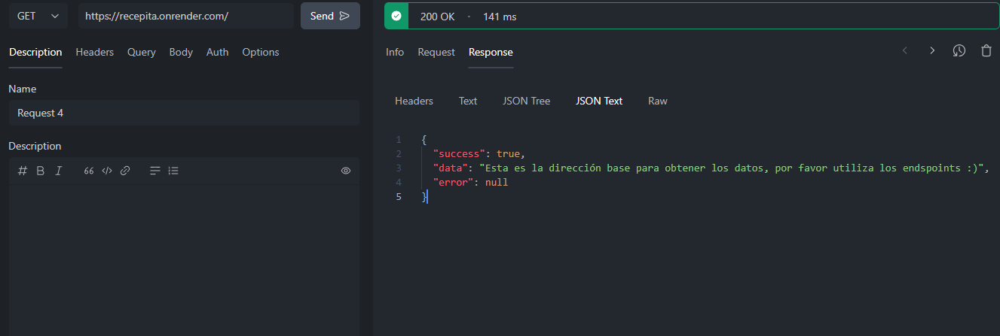
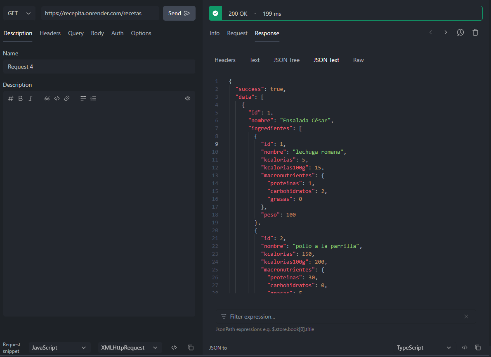
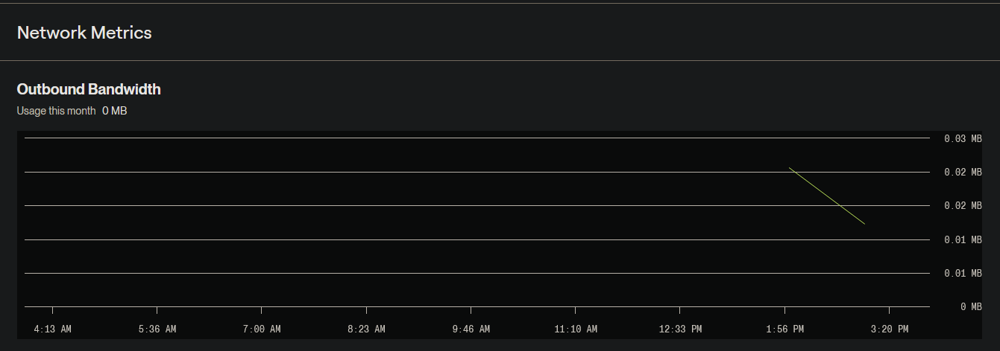

# HITO 5

# URL DESPLIEGUE

La aplicación desplegada estará completamente accesible en la siguiente URL:
[recepita.onrender.com](https://recepita.onrender.com)

## DESCRIPTCIÓN Y JUSTIFICACIÓN DEL PaaS

Para desplegar la API REST del proyecto "Recepita", se evaluaron varias plataformas PaaS en función de los siguientes criterios:

- Compatibilidad con Docker: La aplicación utiliza contenedores Docker, por lo que era esencial que la plataforma soportara despliegues basados en Docker.

- Integración con GitHub: Se buscó una solución que permitiera integrar el repositorio de GitHub para automatizar los despliegues.

- Facilidad de uso: La plataforma debía ofrecer un flujo de trabajo sencillo para configurar y gestionar el despliegue.

- Escalabilidad automática: Era importante que el servicio pudiera escalar automáticamente según la demanda.

- Costo: Se priorizó una solución con un plan gratuito que ofrezca múltiples funcionalidades.

### OPCIONES VALORADAS

- Heroku: Ofrece soporte para Docker y despliegues automáticos desde GitHub. Sin embargo, su plan gratuito tiene limitaciones estrictas en tiempo de actividad y recursos.

- Render: Compatible con Docker, integración directa con GitHub, escalabilidad automática y un plan gratuito generoso. Además, permite configurar variables de entorno fácilmente.

- DigitalOcean App Platform: Excelente soporte para Docker y GitHub, pero su plan gratuito es más limitado que Render.

- Fly.io: Ofrece baja latencia global y soporte para Docker, pero requiere configuraciones más avanzadas.

**Decisión final:** Se eligió Render por su equilibrio entre facilidad de uso, compatibilidad con Docker, integración con GitHub y escalabilidad automática. Su plan gratuito es suficiente para las necesidades del proyecto.

**Nota:** No ha sido necesario el uso de un IaaS.

## DESCRIPCIÓN Y JUSTIFICACIÓN DE LAS HERRAMIENTAS USADAS

Para desplegar la aplicación "Recepita", se utilizaron las siguientes herramientas:

- **Docker:** La aplicación está empaquetada en un contenedor Docker mediante un archivo Dockerfile. Esto garantiza que el entorno sea consistente entre desarrollo y producción.
  **Justificación:** Docker permite empaquetar todas las dependencias necesarias para ejecutar la aplicación, evitando problemas de compatibilidad entre entornos.

- **Render:** Plataforma PaaS seleccionada para alojar la API REST.
  **Justificación:** Render permite desplegar aplicaciones basadas en Docker directamente desde un repositorio GitHub, lo que simplifica el flujo de trabajo.

- **GitHub:** Repositorio donde se aloja el código fuente del proyecto.
  **Justificación:** Render se integra directamente con GitHub, lo que facilita los despliegues automáticos cada vez que se actualiza el código.

Estas herramientas fueron elegidas por su capacidad de trabajar juntas sin necesidad de configuraciones complejas.

## DESCRIPCIÓN DE LA CONFIGURACIÓN PARA EL DESPLIEGUE AUTOMÁTICO

Con el fichero [Dockerfile](../../Dockerfile) se construye la imagen Docker de la aplicación principal. Como hemos usado render, para poder construir correctamente las imágenes de todos los contenedores, hemos tenido que añadir un fichero [render.yaml](../../render.yaml) con la configuración necesaria para el despliegue. Funciona de igual manera de docker-compose.

Además, se integra automáticamente con GitHub, de manera que cada vez que se realiza un push a la rama `main`, Render construye y despliega la aplicación automáticamente. Estas configuraciones podemos verlas a continuación en las siguientes imágenes:

En el panel de Render:

Se creó un nuevo servicio web seleccionando "Connect a Repository".
Se vinculó el repositorio MiixZ/recepita.
Render detectó automáticamente el archivo Dockerfile y configuró los pasos necesarios para construir y ejecutar el contenedor.
Se configuraron variables de entorno necesarias (por ejemplo, PORT=3000).
Será desplegado en Europa.

La automatización del despliegue con cada commit a la rama `main` podemos comprobarlo con la siguiente imagen:

Y todos los servicios desplegados en Render:

## FUNCIONAMIENTO CORRECTO DEL DESPLIEGUE

Como ya hemos comprobado en imágenes anteriores, el despliegue se ha realizado correctamente y la aplicación está accesible en la [URL proporcionada](https://recepita.onrender.com/).

Además, podemos comprobar el correcto funcionamiento en cuanto a peticiones con las siguientes imágenes:

- La URL asignada por Render permite acceder a la API REST desde cualquier navegador o cliente HTTP (como Postman o cURL).
- Los endpoints definidos en Express responden correctamente a las solicitudes HTTP (GET, POST, etc.).
- El contenedor Docker se ejecuta sin errores gracias a la configuración adecuada del Dockerfile.

## PRUEBA DE PRESTACIONES

Con el plan gratuito, podemos ver el ancho de banda que se ha consumido. Hemos realizado algunas peticiones seguidas, teniendo un tiempo de respuesta prácticamente instantáneo y con la siguiente métrica:

